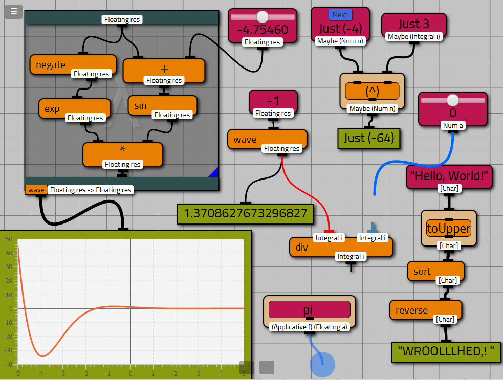

# Viskell

Viskell is an experimental visual programming environment for a typed (Haskell-like) functional programming language.
This project is exploring the possibilities and challenges of interactive visual programming in combination with the strengths and weaknesses of functional languages.

While many visual programming languages/environments exist, they are often restricted to some application domain or a specific target audience.
The potential of advanced type systems and higher level abstractions in visual programming has barely been explored yet.

### Background information
[Short project overview presentation](viskell-nlfpday.pdf) as given on the Dutch Functional Programming Day of Jan 8, 2016.

### Goals and focus points

  * Creating readable and compact visualisations for functional language constructs.
  * Immediate feedback on every program modification, avoiding the slow edit-compile-debug cycle.
  * Experimenting with a multi-touch focused user interface, supporting multiple independently acting hands.
  * Type-guided development: program fragments show their types, and type error are locally visualised.
  * Raising the level of abstraction (good support for higher order functions and other common Haskell abstractions).
  * Addressing the scalability issues common to creating large visual programs.

### Status

Viskell is not yet usable for anything practical, however suggestions from curious souls are very welcome.
While being nowhere near a complete programming language, most basic features have an initial implementation.
Every aspect of the design and implementation is still work in progress, but ready for demonstration purposes and giving an impression of its potential.

### Building Viskell

To build an executable `.jar` file that includes dependencies, check out this repository, then run

    mvn package

Java 8, GHC and QuickCheck are required. Importing as a Maven project into any Java IDE should also work.

You can also download a [pre-built binary jar archive](https://github.com/viskell/viskell/releases/download/nlfp-day-demo/viskell-0.1.jar).

#### Using the touch interface (and the mouse alternatives)
 * Moving a block: dragging by one finger (or primary mouse button)
 * Making a connection: draw with one finger from a connection point to another (or with primary mouse button)
 * Open function menu: two finger tap on a background area (or click by secondary mouse button)
 * Open context menu: two finger tap on the non transparent parts of a block (or click by secondary mouse button)
 * Panning an area: two finger drag on background area (or drag with secondary mouse button)
 * Cut a connection: draw a line across and trace it back to it starting point, by one finger (or primary mouse button)
 * Wire context menu: while drawing a connection tap a second finger next to it (or click by secondary mouse button)
 * Curry a function: on an orange function block drag down the type label by one finger (or primary mouse button)
 * Splitting a wire based on type: while drawing a connection put down a finger next to it and pull them apart in either horizontal or vertical direction (this action is work in progress and has no mouse alternative yet)

##### FAQ

* Why is the implementation in Java 8/JavaFX?
  * It was considered the least problematic option at the start of this project.
    Haskell unfortunately lacks suitable GUI libraries, and we need good multi-touch support (3+ independently moving touchpoints) that is also cross platform.
    And secondly not all of the initial contributors were experienced with Haskell.
    Eventually we want to transition to a browser based GUI combined with Haskell on a local server.
